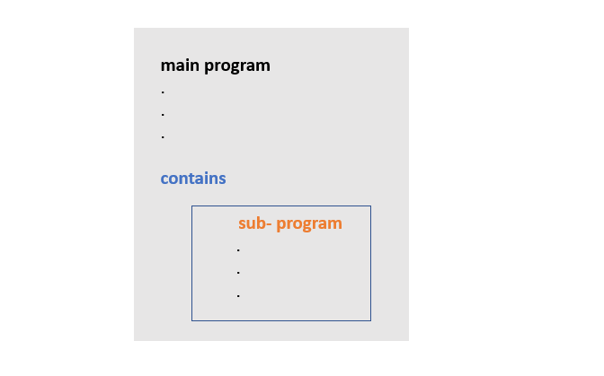
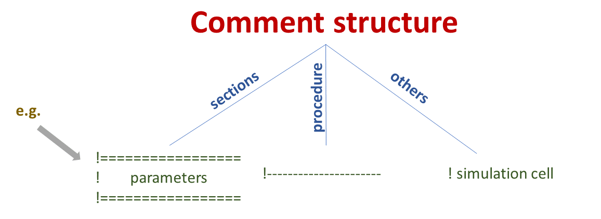

<!---  <style>H1{color:Blue;}</style> --->

<!---  <style>H2{color:DarkOrange;}</style> --->

<!---  <style>p{color:Black;}</style> --->

# **Procedural programming paradigm**

The repository contains phase-field Fortran codes using 

* internal procedures
* do concurrent

## **Introduction**

Procedures in Fortran are of two types:

*  functions
*  subroutines

Function outputs a single value, however a subroutine can produce several values. This is the primary distinction between a function and a subroutine. Additionally, a user-defined function is used similarly to an intrinsic function, however using a subroutine requires a `call` keyword [[Ref]](https://en.wikibooks.org/wiki/Fortran/Fortran_procedures_and_functions).

<span style="color:green "> **Internal procedures**</span> differ from the <span style="color:green "> **intrinsic procedures**</span>. The intrinsics are defined by the standard e.g., [call cpu_time ( )](https://gcc.gnu.org/onlinedocs/gfortran/CPU_005fTIME.html). Internal procedures, on the other hand, are defined by the user and are placed in the same file. The contains statement separates the main program from the subprogram i.e., the internal procedure. The basic idea is shown below.



In many aspects, procedures are similar to the main program. They have a similar appearance, a name, and can also have local variables. That is why the procedures are also called sub-programs.

The subprogram declares the dummy arguments with the intent attribute and can also declare local variables. In subroutine, the intent (out) declared variable stores the value of the expression but in function the value can be stored in function itself. Therefore, Fortran functions are very much like mathematical functions.

The following example does show the use of subroutine and function. The <span style="color:green "> **main program**</span> declares the parameters and makes call to subroutine `fluctuation1` and invokes function `fluctuation2`. 

```Fortran
program example
  implicit none

  integer ( kind = 4 ), parameter :: Nx = 64, Ny = 64
  real ( kind = 8 )   , parameter :: c0 = 0.4, noise = 0.02
  real ( kind = 8 )   , dimension ( Nx, Ny ) :: con

  ! thermal fluctuation

  call fluctuation1 ( con, c0, noise )    ! subroutine
  con = fluctuation2 ( c0, noise )        ! function

  ! internal subprograms

contains

  subroutine fluctuation1 ( con_, c0_, noise_ )
    implicit none

    real ( kind = 8 ), dimension ( Nx, Ny ), intent ( out ) :: con_
    real ( kind = 8 ), intent ( in )                        :: noise_, c0_
    real ( kind = 8 ), dimension ( Nx, Ny )                 :: r_

    call random_number ( r_ )
    con_ = c0_ + noise_*( 0.5 - r_ )

  end subroutine fluctuation1
  
  !---
  
  function fluctuation2 ( c0_, noise_ )
    implicit none

    real ( kind = 8 ), dimension ( Nx, Ny ) :: fluctuation2, r_
    real ( kind = 8 ), intent ( in )        :: noise_, c0_

    call random_number ( r_ )
    fluctuation2 = c0_ + noise_* ( 0.5 - r_ )

  end function fluctuation2

end program
```

The second feature of this repository is the use of <span style="color:green "> **do concurrent construct**</span>. The `do concurrent construct` was introduced in <span style="color:green "> **Fortran 2008**</span>. It aids in generating the vector code to improve performance. In the [previous work](https://github.com/Shahid718/Programming-Phase-field-in-Fortran/tree/main/model_B/example) we have used it already.

Care must be taken when using `do concurrent construct` with procedures. If procedures are called with in do concurrent construct they are required to be <span style="color:green ">**pure**</span>. In pure procedures, the intent attribute of all dummy variable must be declared. These codes  usually use simple procedure for the intial microstructure and the pure procedures for the evolution.

## **Conventions**

Here we present some conventions.

* The <span style="color:green ">**filename**</span> is based on: the algorithm, the model name, dislin library (if used), the type of internal procedure i.e., function or subroutine, and the version. All files are written in free source format.


* The usage of <span style="color:green ">**comments**</span> in the code serves many purposes. They are used to differentiate different sections with the style `==`, for procedures with `---` and for others with simply `!`



* The granularity of the program depends on the number of procedures. For instance, the *left* code makes 4 calls to subroutines and *right* code only 1; therefore, the former is called <span style="color:green ">**fine-grained**</span> and later <span style="color:green ">**coarse-grained**</span> code. 


* The program makes calls to many routines; they are either intrinsic or user defined. To differentiate, we write all *intrinsic subroutines* with <span style="color:green ">**small letters**</span>, and *user-defined routines* with <span style="color:green ">**first letter capital**</span>. 

* The user-defined routines are written with associated action verbs. For instance, we usually introduce fluctuation at the initial stage and we set the boundary conditions. This style is also proposed by [Norman S. Clerman](https://www.amazon.com/Modern-Fortran-Style-Norman-Clerman/dp/052173052X), see <span style="color:green ">**rule 26, 27**</span>. The table clarifies the concept:

|   Intrinsic           |   User-defined                    |
| ----------------------| ----------------------------------|
|   random_number ( )   |  Introduce_fluctuation            |     
|   cpu_time ( )        |  Set_boundary_conditions          |           

* To make the procedure arguments easy to follow, `_` is appended at the end of dummy arguments. This practice makes them consistent with the actual argument. For example, the code above has the dummy argument `con_` for the actual argument `con`.

## **Get the code**

```
gh repo clone Shahid718/Fortran-Phase-field-codes-using-Internal-Procedures
```

## **Compile and run**

* The <span style="color:green ">**general commands** </span> with <span style="color:green ">**dislin graphical library** </span> are:

For **Linux OS** &mdash; with **gfortran** &mdash; to compile, enter
>gfortran main.f90 -o main -L/usr/local/dislin/ -I/usr/local/dislin/gf/real64 -ldislin_d

and to run, enter
>./main

and for **windows** &mdash; with **gfortran** and with **intel** &mdash; to compile, enter
>gfortran main.f90 -o main -Ic:\dislin\gf\real64  c:\dislin\dismg_d.a -luser32 -lgdi32  -lopengl32

>ifort main.f90 -Ic:\dislin_intel\ifc\real64 c:\dislin_intel\disifl_d.lib user32.lib gdi32.lib opengl32.lib

and to run, enter
>main

* For the codes without dislin, there is no need to link the dislin library.

## **Contact**

In case, you find issues to report or having trouble using the codes, you may contact via email

shahid@rwth-aachen.de

shahid@postech.ac.kr
