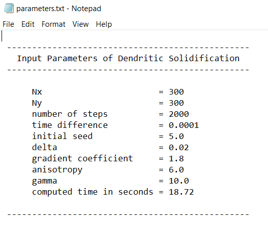

<style>H1{color:blue;}</style>

<style>H2{color:DarkOrange;}</style>

<style>p{color:Black;}</style>

# **Fortran Phase-field dendrite simulation using internal procedures**

This work uses **internal procedures** for 2D simulation of dendrite growth by Kobayashi model. The fundamental ideas are presented as

* Fortran implementation
* Functions
* Subroutines

The first part demonstrates: How to implement the code, and what are the expected outputs? The following sections explains the codes with functions and subroutines.

# **Fortran implementation**

If the **dislin code** runs successfully, it produces two kinds of outputs; one is shown on the console. The console output shows the done steps as in the previous repository but does not show the dislin plot. The dislin plot and the field files are saved as: 

```
Output_files
├── parameters.txt
├── dislin.png
├── phi_2000.dat
└── temperature_2000.dat
```

**dislin** is the default name of the output Dislin plot.

The **parameters** file is created as



# **Functions**

The function files are:

```
├── fd_dendrite_dislin_func_v1.f90
├── fd_dendrite_dislin_func_v2.f90
├── fd_dendrite_func_v1.f90
└── fd_dendrite_func_v2.f90
```

## **Flow Chart version 1**

The basic structure of the **main program** is shown in the figure below. The left column shows the three main sections. The middle column shows the function calls in those sections. The right side shows the numerical scheme where the equations relavant to those procedures call are presented in different color scheme.


Here we briefly describe **fd_dendrite_dislin_func_v1.f90**

### **Parameters**

This section defines and declare the parameters as in the previous repository.

### **Initial microstructure**

The statement invokes the function `initial_microstructure`. It takes `seed` as actual argument and assigns the function value to the `phi` array. 

Now the area where `phi = 1` is a small solid initial structure and others have `phi = 0`. The initial temperature is `0` in the system.

It can be seen in the output dislin file for `step = 1`


```Fortran
  tempr = 0.0
  phi = 0.0

  phi = Initial_microstructure ( seed )
```

### **Setting Initial Dislin routines for multiplot**

To get the multiplot, the initial dislin routines are called here. `png` file format is set with routine `metafl ()`. The default background colour for graphical windows and image formats such as TIFF, GIF and PNG is black and is changed to white with the routine `scrmod ()`. `disini` initializes dislin.

```Fortran
  call metafl ( 'png' )
  call scrmod ( 'revers' )
  call disini ( )
```

### **Evolution**

Here we present just the function calls.

The `Laplacian` function is used for both `phi` and `temperature` fields. Two `gradient` functions are invoked for `x` and `y` directions. 

Theta is evaluated with the `Theta_angle` function. `Factor_m` function is invoked to find the value of m.

The computed steps are printed on the screen with the next statement.

The next call is for color plot with Dislin library. The dislin graphical library module is included in the begining. This library has many subroutines as we used in the previous repository. Therefore, to make it under one subroutine call i.e., `Dislin_color_multi_plot()` we put together all those related routines. This makes it easy to get the plot with a single call. We set the plots at two times steps `1` and `2000`

```Fortran
  time_loop: do step = 1, no_of_steps

        ...
        ! invoking laplacian function

        lap_phi = Laplacian ( phi, dx, dy, i , j, ip, jp, im, jm )
        lap_tempr = Laplacian (tempr, dx, dy, i , j, ip, jp, im, jm )

        ! invoking gradient function

        phidx = Gradient_x ( phi, dx, i, j, im, ip, jm, jp )
        phidy = Gradient_y ( phi, dy, i, j, im, ip, jm, jp )

        ! invoking angle function

        theta = Theta_angle ( phidy, phidx, i, j )
        ...

        ! invoking function 

        m = Factor_m ( alpha, pix, gama, teq, tempr, i, j )
        ...


       ! print steps on the console

       if ( mod ( step, frequency ) .eq. 0 ) print *, 'Done steps  = ', step

       ! save multiplot

       call Dislin_color_multi_plot ( )


  end do time_loop
```
The statement is used to calculate the last time of the code execution.

```Fortran
call cpu_time ( finish )
```

### **Output**

The output section makes two calls for writing data on the files; the first call writes parameters which are initially provided and the computed time, the second one writes field values at the end of the simulation. 

```Fortran 
  call Write_input_parameters_on_file
  call Output_phi_and_temperature_on_files
```

The contains statement separates the main program from the sub-program (procedures)

```Fortran
   contains
```

### **Internal subprograms**

This section has the user defined procedures (table 1). The pure routines are declared with `intent attributes` to avoid any side effects. Also this is required if `do concurrent` construct is used.


**Table 1:** Routines and functions used in the program. 

|   Intrinsic           |   User-defined                        |
| ----------------------| ----------------------------------    |
|   random_number ( )   |  Initial_microstructure               |     
|   cpu_time ( )        |  Gradient_x                           |         
|                       |  Gradient_y                           |            
|                       |  Theta_angle                          |       
|                       |  Factor_m                             |
|                       |  Dislin_color_multi_plot ( )          |  
|                       |  Write_input_parameters_on_file       |
|                       |  Output_phi_and_temperature_on_files  |  
  

The `Write_input_parameters_on_file` routine opens `unit 1` with filename `parameters` and `replaces` the file if it exists already. It then writes the values with default format specifier `*` or with the provided one. To get the files with field values at the end of the simulation `unit 2` and `unit 3` are opened and the values are written in the matrix form.

## **fd_dendrite_dislin_func_v2.f90**

Here we present the code file with functions for version 2.

### **Parameters**

This section defines parameters that are global in scope. For instance, the grid spacing variables `dx` and `dy` are not defined here as they are related to the procedure calls in the evolution section. Therefore they are declared locally there.

### **Initial microstructure**

It is same as in version 1.

### **Evolution**

The evolution section makes a call to just one routine here. The rest of the section is the same as version 1.

``` Fortran
      ...
      call Perform_evolution ( phi, tempr, lap_phi, lap_tempr, phidx, &
          & phidy, theta, epsil, epsilon_deriv, phi_old, term1, term2, m )
      ...
```
The output of the subroutine is the `phi`, and `tempr` arrays.

### **Output**

The output section makes a single call. Now both write opeations are called with this single procedure. 

```Fortran 
 call Output_files
```

### **Internal subprograms**

This section has the user defined procedures (table 2). Only four procedures are called in the main program.


**Table 2: User-defined procedures**

|                            |
| ---------------------------| 
|  Initial_microstructure    |     
|  Perform_evolution         |       
| Dislin_color_multi_plot ( )|             
|  Output_files              |


# **Subroutines**

For the file `fd_dendrite_dislin_sub_v1.f90`, the basic structure is explain here. 

### **initial microstucture**

The initial microstructure is introduced by the routine call

```Fortran
      call Initial_microstructure ( phi, tempr, seed, i, j )
```

### **evolution**

The evolution section makes individual call to all the parameters or equations ( the parameters determined independently in the previous repository).


```Fortran
  time_loop: do step = 1, no_of_steps

     
     first_spatial_loop:  do concurrent ( j = 1 : Nx , i = 1 : Ny )
        

        call Set_boundary_conditions (i, j, jp, jm, ip, im )

        call Evaluate_laplacian ( phi, tempr, lap_phi, lap_tempr,&
             & dx, dy, i , j, ip, jp, im, jm )

        call Calculate_gradients ( phidx, phidy, phi, dx, dy, i, j, im, ip,&
             & jm, jp )

        call Find_angle ( theta, phidx, phidy, i, j )

        call Compute_epsilon_and_its_derivative ( epsil, epsilonb, delta, &
             & aniso, theta, theta0, epsilon_deriv, i, j )

        
     end do first_spatial_loop

     
     second_spatial_loop:  do concurrent ( j = 1 : Nx , i = 1 : Ny )
        

        call Set_boundary_conditions (i, j, jp, jm, ip, im )

        call Update_phi ( phi_old, phi, i, j )

        call Measure_term1_and_term2 ( term1, term2, epsil, epsilon_deriv,&
             &  phidx, phidy, dy, dx, i, j, ip, im, jp, jm )

        call Determine_factor_m ( m, alpha, pix, gama, teq, tempr, i ,j )

        call Perform_time_integration ( phi, dtime, tau, term1, term2,&
             & epsil, lap_phi, phi_old, m, tempr, lap_tempr, kappa, i, j)

        
     end do second_spatial_loop


     ! print steps on the console

     if ( mod ( step, frequency ) .eq. 0 ) print *, 'Done steps  = ', step

     ! save multiplot

     call Dislin_color_multi_plot ( )


  end do time_loop
```
Below, we show the user-defined procedures in `version 1`.

**Table 3:** 

|                                   |
| --------------------------        |
|  Initial_microstructure           |     
|  Set_boundary_conditions          |                    
|  Evaluate_laplacian               |
|  Calculate_gradients              |
|  Find_angle                       |
| Compute_epsilon_and_its_derivative|
| Update_phi                        |
| Measure_term1_and_term2           |
| Determine_factor_m                |
| Perform_time_integration          |
| Write_input_parameters_on_file |
|  Output_phi_and_temperature_on_files|

For `version 2`, the evolution section is same as in `version 2` of function file.