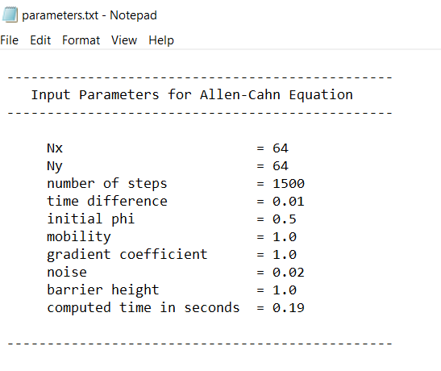

<style>H1{color:blue;}</style>

<style>H2{color:DarkOrange;}</style>

<style>p{color:Black;}</style>

# **Fortran Phase-field Allen-Cahn Simulation using internal procedures**

This work uses **internal procedures** for 2D simulation of Allen-Cahn-Hilliard. The fundamental ideas are presented as

* Fortran implementation
* Subroutines
* Functions

The first part demonstrates: How to implement the code, and what are the expected outputs? The following sections explains the codes with subroutines and functions.

# **Fortran implementation**

If the **dislin code** runs successfully, it produces two kinds of outputs; one is shown on the console. The console output shows the done steps as in the previous repository but does not show the dislin plot. The dislin plot with other files are saved as: 

```
Output_files
├── parameters.txt
├── dislin.png
└── phi_1500.dat
```

**dislin** is the default name of the output Dislin plot.

The **parameters** file is created as



# **Subroutines**

The subroutine files are:

```
├── fd_ac_dislin_sub_v1.f90
├── fd_ac_dislin_sub_v2.f90
├── fd_ac_sub_v1.f90
└── fd_ac_sub_v2.f90
```

## **Flow Chart version 1**

The basic structure of the **main program** is shown in the figure below. The left column shows the three main sections. The middle column shows the procedure's calls in those sections. The right side shows the numerical scheme where the equations relavant to those procedures call are presented in different color scheme.


Here we briefly describe **fd_ac_dislin_sub_v1.f90**

### **Parameters**

This section defines and declares the parameters as in the previous repository.

### **Initial microstructure**

The statement makes call to introduce the fluctuations in the system. `phi` array is the output of this call.

```Fortran
call Introduce_fluctuation ( phi, initial_phi, noise )
```
### **Evolution**

This part starts the evaluation at each time step for all grid points. `time_loop` and `spatial_loop` are the names of the do constructs respectively.

First the code deploys the boundary conditions, then the derivative of free energy followed by the laplacian and finally the explicit Euler time integration.

To adjust phi within `0.0` and `1.0` the program has whole array masking statement here. `Where statement` is a way to avoid indexed array masking statement or construct.

To be informed with the computed steps, the next statement prints out the done steps at the given frequency.

The last statement terminates the evolution once the desired number of steps are reached.

```Fortran
  time_loop: do step = 1, no_of_steps


     spatial_loop:  do concurrent ( j = 1 : Nx , i = 1 : Ny )


        call Set_boundary_conditions ( i, j, jp, jm, ip, im )

        call Compute_derivative_free_energy ( A, phi, dfdphi, i, j )

        call Evaluate_laplacian ( lap_phi, phi, dx, dy, &
             & i , j, ip, jp, im, jm )

        call Perform_time_integration ( phi, dt, mobility, &
             & grad_coef, lap_phi, dfdphi, i, j )


     end do spatial_loop


     ! adjust order parameter in range

     if ( phi(i,j) >= 0.99999 ) phi(i,j) = 0.99999
     if ( phi(i,j) < 0.00001 )  phi(i,j) = 0.00001


     ! print steps

     if ( mod ( step, frequency ) .eq. 0 )  print *, 'Done steps  = ', step


  end do time_loop
```
The statement is used to calculate the last time of the code execution.

```Fortran
call cpu_time ( finish )
```

### **Output**

The output section makes two calls for writing data on the file; the first call writes parameters which are initially provided and the computed time, the second one writes phi at the end of the simulation. The third call is for color plot with Dislin library. The dislin graphical library module is included in the begining. This library has many subroutines as we used in the previous repository. Therefore, to make it under one subroutine call here i.e., `Dislin_color_plot()` we put together all those related routines. This makes it easy to get the desired plot with a single call.

```Fortran 
  call Write_input_parameters_on_file
  call Output_concentration_on_file
  call Dislin_color_plot ( )
```

The contains statement separates the main program from the sub-program (procedures)

```Fortran
   contains
```

### **Internal subprograms**

This section has the user defined routines (table 1). The pure routines are declared with `intent attributes` to avoid any side effects. Also this is required if `do concurrent` construct is used.


**Table 1:** Routines used in the program. 

|   Intrinsic           |   User-defined                    |
| ----------------------| ----------------------------------|
|   random_number ( )   |  Introduce_fluctuation            |     
|   cpu_time ( )        |  Set_boundary_conditions          |                    
|                       |  Compute_derivative_free_energy   |       
|                       |  Evaluate_laplacian               |
|                       |  Perform_time_integration         |  
|                       |  Write_input_parameters_on_file   |
|                       |  Output_phi_on_file     |  
|                       |  Dislin_color_plot ( )            |  

The `Write_input_parameters_on_file` routine opens `unit 1` with filename `parameters` and `replaces` the file if it exists already. It then writes the values with default format specifier `*` or with the provided one. To get the file with phi values at the end of the simulation `unit 2` is opened and the values are written in the matrix form.

## **Flow Chart version 2**

The basic structure of the main program with **version 2** is shown in the figure below. There are two main columns. The fundamental difference between *version 1* and *2* is the evolution section which has just one call to perform evolution.


Here we present the code **fd_ch_dislin_sub_v2.f90**

### **Parameters**

This section defines parameters that are global in scope. For instance, the grid spacing variables `dx` and `dy` are not defined here as they are related to the procedure calls in the evolution section. Therefore they are declared locally there.

### **Initial microstructure**

Notice the difference of the number of actual arguments.

```Fortran
call Introduce_fluctuation ( phi )
```
### **Evolution**

The evolution section makes a call to just one routine here. The rest of the section is the same as version 1.

``` Fortran
      ...
      call Perform_evolution ( phi , dfdphi, lap_phi, dummy_phi )
      ...
```
The output of the subroutine is the `phi` array.

### **Output**

The output section makes a single call. Now both write opeations and the dislin figures are created with this single call. 

```Fortran 
 call Output_files
```

### **Internal subprograms**

This section has the user defined routines (table 2). Only three routines are called in the main program i.e., one in each section.


**Table 2: User-defined routines**

|                            |
| ---------------------------| 
|  Introduce_fluctuation     |     
|  Perform_evolution         |                    
|  Output_files              |


# **Functions**

For the files where functions are used, the basic structure is same as in subroutines. 

The thermal fluctuations are introudced by invoking the function `Introduce_fluctuation`

```Fortran
      phi =  Introduce_fluctuation( initial_phi, noise )
```

In the **evolution section** of `version 1, ` the `deriv_free_energy` function calculates the derivative at each grid point and stores the value in the array `dfdphi`

The variable array `dfdphi` is then passed as an input arguement together with other actual arguments to the next function `laplacian`. The laplacian function calculates the value at each grid point and stores in the variable array `laplace`. Finally, the last expression evaluates time integration using laplace as an array.

The evolution section thus has two function references and one array expression.

```Fortran
           dfdphi = Deriv_free_energy ( A, phi, i, j )

           laplace = Laplacian ( lap_phi, phi, dx, dy, &
                &  i, j, ip, jp, im, jm )

           phi(i,j) = phi(i,j) - dt*mobility*( dfdphi(i,j) - &
                & grad_coef*laplace(i,j) )
```
Below, we show the user-defined functions in `version 1`.

**Table 3:** 

|    |
| --------------------------|
|  Introduce_fluctuation    |     
|  Deriv_free_energy        |                    
|  Laplacian                |

For `version 2`, the evolution section invokes the `Dummy_phi` function in the expression:

```Fortran
...
 phi = phi - dt*mobility*Dummy_phi( phi , dfdphi, lap_phi )
...
```

Mathematically it is

$$ {\phi_{ij}^{n+1} } = \phi_{ij}^n + \Delta t M  \left( \frac{\partial f}{\partial {\phi_{ij}^{n}}}-\kappa \nabla^2 {\phi_{ij}^{n}} \right)$$

Where the `Dummy phi` function is

$$   \left( \frac{\partial f}{\partial {\phi_{ij}^{n}}}-\kappa \nabla^2 {\phi_{ij}^{n}} \right)$$

**Table 4: User-defined functions**

|    |
| --------------------------|
|  Introduce_fluctuation    |                       
|  Dummy_phi                |